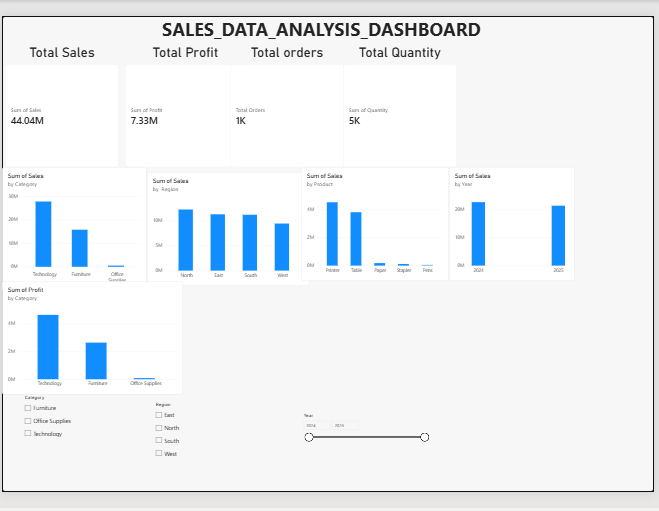

# Sales Data Analysis Dashboard

## 📊 Project Overview

This project analyzes sales data to understand business performance
across different categories, regions, products, and years.

The data was cleaned and analyzed using Excel and Power Query, and an
interactive dashboard was created using Power BI to present key
business insights.

## 🛠️ Tools & Technologies

- Microsoft Excel
- Power Query
- Power BI
- Data Cleaning
- Data Analysis
- Data Visualization

## 📁 Dataset

The dataset contains 1,000 sales records from 2024 to 2025.

### Key Columns

- Order ID
- Order Date
- Customer
- Category
- Product
- Region
- Quantity
- Sales
- Discount
- Profit

## 📈 Key KPIs

| KPI | Value |
|---|---:|
| Total Sales | 44.04M |
| Total Profit | 7.33M |
| Total Orders | 1,000 |
| Total Quantity | 5,426 |

## 📊 Dashboard Analysis

The Power BI dashboard provides analysis of:

- Sales by Category
- Sales by Region
- Sales by Product
- Sales by Year
- Profit by Category

Interactive slicers were added for:

- Category
- Region
- Year

## 🔍 Key Insights

- Technology generated the highest sales among the categories.
- Technology also contributed the highest profit.
- Sales were distributed across all four regions.
- Printers and Tables were among the major products by sales.
- The dashboard allows users to compare sales performance across
  2024 and 2025.

## 🎯 Business Objective

The objective of this project is to analyze sales and profitability
and present the findings through an interactive dashboard to support
data-driven business decisions.

## 📷 Power BI Dashboard

